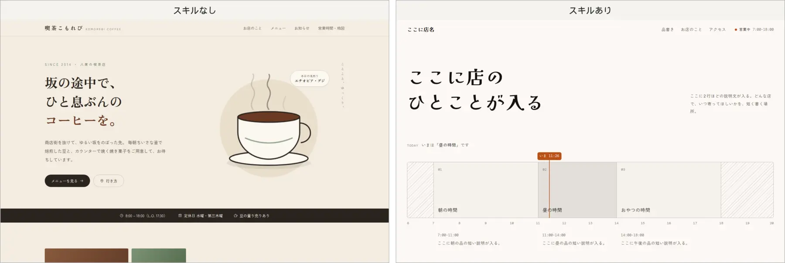
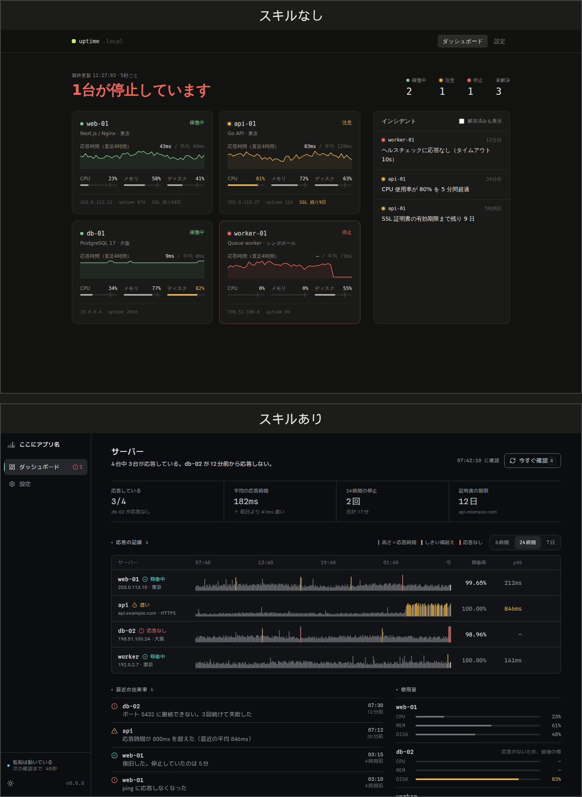
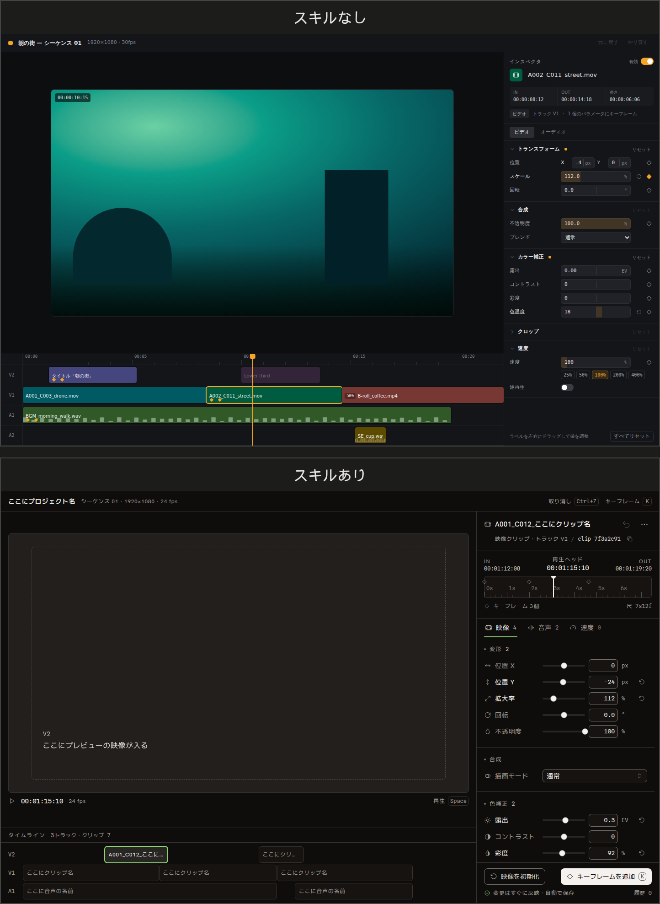

# versatile-design

Claude に「AI 感のない」プロ水準のデザインを出力させるためのスキル集である。

何も指示しなければ、生成されるデザインは平均的で無難なもの（紫のグラデーション、中央寄せの大見出しとボタン2つ、角丸カードの3列、定番フォントだけの組版など）に寄る。このスキル集は、その平均への回帰を、具体的な禁止事項・数値・手順・機械的な検査で止める。スキルはモデルの地力を上げるものではなく、作者の審美眼を言葉と数値にしてモデルに渡すための器である。

## スキルの一覧

| スキル | 役割 |
|---|---|
| `design-core` | 媒体に依存しない思想、コンセプト先行の手順、禁止リスト、色と文字の原則、スクリーンショットによる自己批評 |
| `web` | Web のサイト系とアプリ系の UI。React ＋ Tailwind CSS（v4）＋ React Aria Components。ファビコンの作り方、禁止パターンの自動チェック、スクリーンショットの撮影スクリプトを含む |

- `web` は最初に `design-core` を読む。2つは必ず組で使う。
- サイト系の依頼では、作る前にコンセプトの案が 2〜3 個と技術スタックの提案が出て、選んでから作られる。「おまかせで」と書けば、選ばずに進む。
- キャッチコピー、見出し、本文は、`web` の `references/copy.md` の書き方に従って、依頼に書かれた事実から書かれる。依頼の情報が足りない場所と、ボタンなどの短い文言は、ダミーと分かる形（「ここに見出し」など）で置かれる。
- このスキル集は、frontend-design スキルと併用しない前提で作っている。

## スキルの有無による違い

同じ依頼を、スキルなしとスキルありで作らせた結果を並べる。どれも PC 幅（1440px）の最初の画面である。

- スキルあり側は、依頼に書かれていない文章を作らない決まりに従い、仮の文章（「ここに店名」など）で組まれている。スキルなし側は架空の店名や作品名で埋めている。文章の出来ではなく、見た目の判断を比べてほしい。
- スキルなし側のダッシュボードと編集パネルにはライトモードがなく、ライトモードで撮っても暗い画面のままである。

**「街の小さなカフェのWebサイトを作って。トップページだけでよい」**



**「個人開発者向けのサーバー監視ダッシュボードを作って。設定画面も1つ付けて」**



**「動画編集ツールの、選択したクリップのパラメータを編集するパネルを作って」**



## 導入方法

Claude Code のプラグインとして導入する方法を勧める。コマンド2つで導入でき、更新もコマンド1つで済む。

### プラグインとして導入する（推奨）

Claude Code のセッションの中で、次の2つを実行する。

```
/plugin marketplace add Nek0cha/versatile-design
/plugin install versatile-design@versatile-design
```

- 導入したスキルは `versatile-design:design-core`、`versatile-design:web` という名前になる。見た目を作る依頼をすれば自動で読まれる。
- 更新するときは `/plugin marketplace update versatile-design` を実行する。`/plugin` の「Marketplaces」でこの配布元を選び、自動更新を有効にしてもよい。
- 好みの設定（下の「調整欄の仕組み」）はプラグインの外に置くため、更新しても消えない。

### スキルのディレクトリに直接置く

プラグインを使わない場合は、2つのスキルをスキルのディレクトリにコピーする。`web` は `../design-core/` という相対パスで `design-core` を読むため、2つを同じディレクトリに並べて置く。

```sh
# すべてのプロジェクトで使う場合
mkdir -p ~/.claude/skills
cp -r skills/design-core skills/web ~/.claude/skills/

# 特定のプロジェクトだけで使う場合
mkdir -p <プロジェクト>/.claude/skills
cp -r skills/design-core skills/web <プロジェクト>/.claude/skills/
```

更新するときは、同じコマンドで上書きでコピーする。

### 必要なもの

- Node.js 22 以上（`web` のスクリプトの実行に使う）
- 生成物は React と Tailwind CSS v4 を前提にする。フレームワーク（Vite、Astro、React Router、Next.js）は依頼の規模に合わせて提案され、利用者が選ぶ。React Aria Components、Iconify（`@iconify/react`）、Motion、GSAP、three などは、生成するプロジェクトに必要に応じて導入される。

## スクリーンショット用の playwright の導入

`web` の検証の手順では、`scripts/screenshot.mjs` が Playwright で PC 幅（1440px）とスマートフォン幅（390px）、ダークとライトのスクリーンショットを撮る。Playwright が導入されていない環境では撮影を省略し、その旨が報告に書かれる（自動チェックとコードの読み直しで代わりに検証する）。

撮影の前に、フォントの読み込みを待ち、ページの下端までスクロールして戻り、繰り返さないアニメーションの完了を待ってから、さらに `--wait <ミリ秒>`（既定は 1500）だけ待つ。対象には URL、ローカルの HTML ファイルのパス、`localhost:5173` のようなホストとポート（`http://` を補う）を渡せる。

`screenshot.mjs` は、まずスクリプト自身の置き場所から上のディレクトリにある `node_modules` から `playwright` を探し、見つからなければコマンドを実行したディレクトリ（作業中のプロジェクト）から探す。スキルをどこに置いた場合でも、作業するプロジェクトに入れる方法を勧める。

```sh
cd <プロジェクト>
npm i -D playwright
npx playwright install chromium
```

プロジェクトに依存を足したくない場合は、スキルのディレクトリに直接置いた `web` の中に入れてもよい。プラグインとして導入した場合は、更新のたびにスキルのディレクトリが入れ替わるため、この方法は使えない。

```sh
cd ~/.claude/skills/web   # プロジェクトの .claude/skills/ に置いた場合はそのディレクトリ
npm i playwright
npx playwright install chromium
```

- `npx playwright install chromium` はブラウザ本体をダウンロードする。Linux でブラウザの起動に必要なライブラリが足りない場合は、`npx playwright install --with-deps chromium` を使う。
- 手元にある Chromium を使いたい場合は、環境変数 `CHROMIUM_PATH` に実行ファイルのパスを指定する。
- 撮った画像は作業用ディレクトリに保存され、リポジトリには含めない。

## 調整欄の仕組み

好みは2種類の調整欄で上書きできる。

- **ユーザーの調整欄**：利用者が好み（好きな色、避けたい色、好きなフォント、避けたいもの、テーマの既定、アニメーションの好みなど）を書くファイル。スキルの外に置くため、スキルを更新しても消えない。
- **スキル作者の調整欄**：各 `references/` のファイル内にある「スキル作者の調整欄」の表の初期値。スキル作者が育てていく。

優先順位は次のとおりである。

1. プロンプトでの指示
2. ユーザーの調整欄
3. スキル作者の調整欄

### ユーザーの調整欄の置き場所

| 場所 | 効く範囲 |
|---|---|
| `~/.claude/versatile-design/preferences.md` | すべてのプロジェクト |
| `<プロジェクト>/.claude/versatile-design/preferences.md` | そのプロジェクトだけ |

- 両方ある場合は、項目ごとにプロジェクトのほうが優先される。プロジェクトのほうで空にした項目は、すべてのプロジェクト用のほうが使われる。
- どちらもない場合と、見出しの下が空の項目は「好みなし」として扱われ、スキル作者の初期値が使われる。
- 書式は `skills/design-core/preferences-template.md` のひな形のとおりである。Claude に「デザインの好みを設定して。アクセントは深い緑にしたい」のように頼めば、ひな形からこのファイルを作って書き込む。自分で作る場合は、ひな形を写して見出しの下に書く。

```sh
mkdir -p ~/.claude/versatile-design
cp skills/design-core/preferences-template.md ~/.claude/versatile-design/preferences.md
```

## 開発者向けのコマンド

```sh
npm install            # 開発用の依存を入れる
npm test               # lint ルール、スクリーンショット、検査ツールのテスト
npm run check:skills   # SKILL.md の frontmatter、参照先のパス、実例名の匿名化を検査する
npm run check:recipes  # 部品のレシピのコード例を lint と型検査にかける
claude plugin validate .   # プラグインと配布元の設定ファイル（.claude-plugin/）を検査する
```

- WSL で `npm` を実行すると Windows 側の npm が呼ばれる場合がある。その場合は、WSL 側に Node.js（npm を含む）を入れるか、`pnpm dlx npm@11 <コマンド>` で実行する。テストと検査は `node --test "tests/**/*.test.mjs"`、`node tools/check-skills.mjs`、`node tools/check-recipes.mjs` で直接実行してもよい。

- `npm test` のスクリーンショットのテストは、ブラウザを起動できない環境ではスキップされる。手元の Chromium を使う場合は `CHROMIUM_PATH=<パス> npm test` とする。
- `npm run check:skills` で実例名の匿名化を検査するには、禁止語を1行に1つ書いたファイルを環境変数 `REFERENCE_DENYLIST` で渡す（例：`REFERENCE_DENYLIST=<ファイル> npm run check:skills`）。対象は `skills/`、`docs/`、`README.md` である。指定がなければ匿名化の検査は省略され、指定したファイルが存在しないか空の場合は警告を出して省略する。禁止語のファイルはリポジトリに含めない。
- 禁止パターンを増やすときは、`skills/design-core/references/anti-patterns.md` の「スキル作者の調整欄」の手順に従い、機械で判定できるものは `skills/web/scripts/lib/lint-rules.mjs` にルールを足す。

## 実例の取り扱い方針

デザインの原則と数値は、実在のサイトやアプリの観察から取り出しているが、実物のコピーは一切含めない。数値や手法などのアイデアと事実は自由に使え、具体的な表現（コード、画像、文章）は保護される、という線引きに基づく。

- 含めるもの：観察した数値、原則の言語化、フォント名とライブラリ名、匿名化した出典のラベルと観察日。
- 含めないもの：サイトの HTML・CSS・JS（一部分も含む）、画像、ロゴ、写真、文章、フォントファイル、スクリーンショット。
- スクリーンショットは分析のときに作業用ディレクトリで一時的に扱うだけで、リポジトリには含めない。提供されたスクリーンショットは、分析結果以外を保存しない。
- スキルには「〇〇のサイトのようにする」という指示を書かず、抽出した原則と数値の幅だけを渡す。1つの実例の数値をまとめて移植せず、複数の実例から傾向として取り出す。
- 実例のサービス名・アプリ名・サイト名は、スキルのファイルと設計書に書かない。「サイト1（個人のポートフォリオ）」「アプリA（チャット）」のような匿名のラベルと種類で表す。実例とラベルの対応表はリポジトリに含めず、スキル作者の手元だけで管理する。
- 公開されている一般的な技術情報（ライブラリ名、フォント名、Web 標準の仕様名）は匿名化の対象外とする。
- 配布の範囲を広げる際は、必要に応じて専門家に確認する。

## ライセンス

`LICENSE` を参照のこと。
